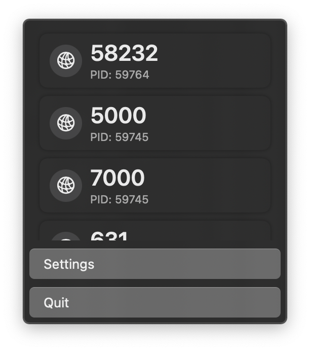
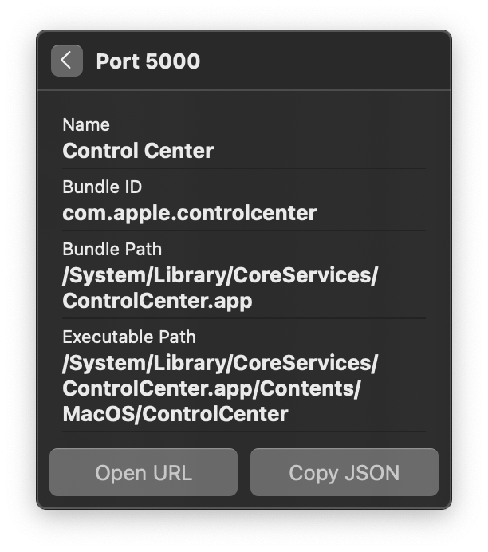
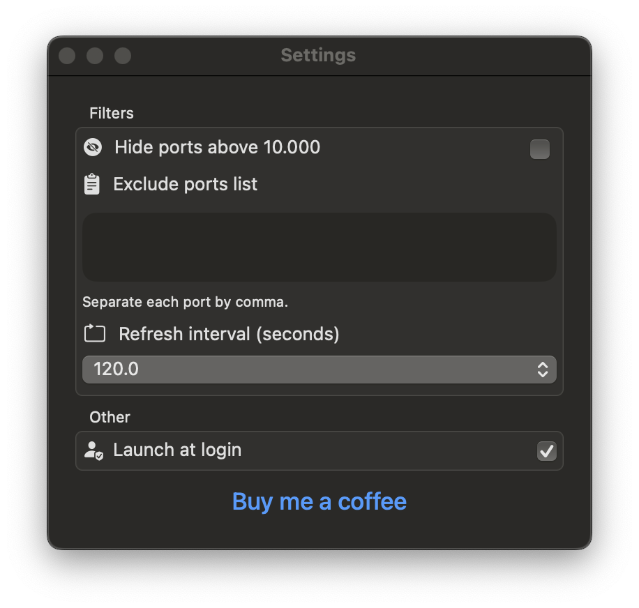

# OpenSesame

OpenSesame is a macOS menu bar application designed to enhance your network security and awareness. This utility tool allows you to monitor and manage open network ports on your Mac machine, ensuring you have complete control over your network connections.

## Features

- **Network Port Listing**: Displays all open network ports on your macOS device.
- **Process Identification**: Identify which process or application has opened a specific port, complete with metadata.
- **Interactive Port Items**: Click on a port item in the list to view detailed information.
- **Port Filtering**: Exclude ports above 10000 and custom port ranges from the list for focused monitoring.
- **Native Performance**: Built using Swift and SwiftUI for seamless integration and performance on macOS.

## Supported Platforms

- macOS version 13.0 and above.

## Installation

1. Download the latests `.dmg` from [here](https://github.com/rashadatjou/open-sesame/releases/download/1.0.1/OpenSesame-1.0.1.dmg)
2. Open the `.dmg`
3. Drag and drop `OpenSesame.app` to `/Applications`
4. Open `OpenSesame.app`

## Usage

## Usage

OpenSesame provides a user-friendly interface directly from your macOS menu bar, giving you instant access to a wealth of information about the network ports on your machine. Here's how to use OpenSesame to its fullest potential:

1. **Access from the Menu Bar**: Click on the OpenSesame icon in the menu bar to open the dropdown interface.
2. **View Open Ports**: Upon opening, you'll see a list of currently open ports with their corresponding Process IDs (PIDs).
   - Each port is listed with an icon, the port number, and the PID of the process that opened the port.
   - For instance, you might see "58232 - PID: 59764" indicating that port 58232 is open and being used by the process with PID 59764.
3. **Explore Port Details**: Click on a port to see detailed metadata, such as the application name, bundle ID, bundle path, and executable path.
   - For example, clicking on port 5000 might reveal that it's being used by the Control Center with detailed paths provided.
4. **Manage Settings**: Select 'Settings' to adjust how OpenSesame behaves.
   - **Filters**: Enable the option to "Hide ports above 10.000" if you wish to focus on lower-numbered ports. You can also specify a list of ports to exclude from the display.
   - **Refresh Interval**: Set how frequently OpenSesame refreshes the list of open ports.
   - **Launch at Login**: Choose whether OpenSesame starts automatically when you log in to your Mac.
5. **Direct Actions**: Some ports may offer direct actions such as "Open URL" for web services or "Copy JSON" for easy sharing of the port's information.

For any changes in the settings or additional features you wish to utilize, make sure to explore the 'Settings' panel thoroughly and tailor OpenSesame's behavior to your preferences. Whether you're monitoring your network for security purposes or just curious about the goings-on behind the scenes, OpenSesame provides a clear and detailed window into your Mac's network activity.

## Screenshots

    <table>
        <tr>
            <td>
                
                
<em>App Icon</em>

            </td>
            <td>
                
                
<em>Port list</em>

            </td>
        </tr>
        <tr>
            <td>
                
                
<em>Port Detail</em>

            </td>
            <td>
                
                
<em>Settings</em>

            </td>
        </tr>
    </table>

## Building from Source

### Prerequisites

- Xcode 15
- Swift 5.9

### Steps

1. Clone the repository: `git clone https://github.com/rashadatjou/open-sesame.git`
2. Navigate to the cloned directory: `cd OpenSesame`
3. Open the project in Xcode: `open OpenSesame.xcodeproj`
4. Build and run the project in Xcode.

## Contributing

We warmly welcome contributions from the community to OpenSesame! If you wish to contribute, please follow these steps:

1. **Fork the Repository**: Start by forking the OpenSesame repository to your GitHub account.
2. **Create a Branch**: For each new feature or bug fix, create a new branch off the `main` branch.
3. **Code**: Implement your feature or bug fix.
4. **Follow Coding Standards**: Ensure your code adheres to the coding standards used in OpenSesame.
5. **Write Tests**: If possible, write unit tests to validate your changes.
6. **Document Your Changes**: Update the README or documentation with details of changes to the interface, this includes new environment variables, exposed ports, useful file locations, and container parameters.
7. **Pull Request**: Submit a pull request to the main OpenSesame repository. Include a clear description of the changes and any relevant issue numbers.
8. **Code Review**: Wait for a maintainer to review your pull request. Make any requested changes.

By contributing, you agree that your contributions will be licensed under its [LICENSE](./License.md).

## Support

If you need assistance with OpenSesame or want to report an issue, please feel free to open a support ticket using GitHub Issues. Here's how you can do that:

1. Navigate to Issues: Go to the 'Issues' tab in the OpenSesame GitHub repository.

2. Check Existing Issues: Before creating a new issue, please check if a similar issue already exists or has been closed previously.

3. Create a New Issue: If your issue is unique, click on 'New Issue'. You'll be prompted to choose a template that best fits your issue type - be it a bug report, feature request, or general query.

4. Fill in the Details: Provide a detailed description of your issue or inquiry. Include steps to reproduce the issue if applicable, any error messages you encountered, and screenshots if relevant.

5. Submit: Once you've filled out all necessary information, submit the issue.

